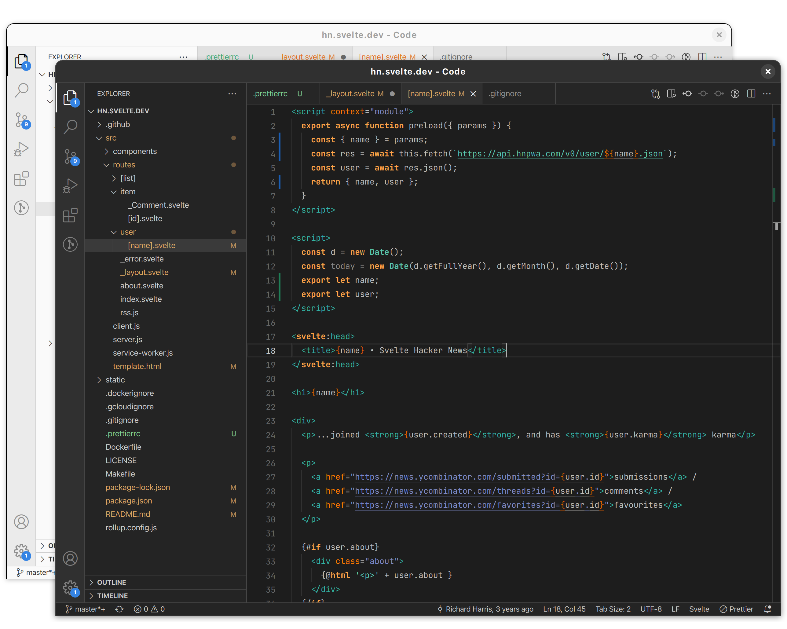
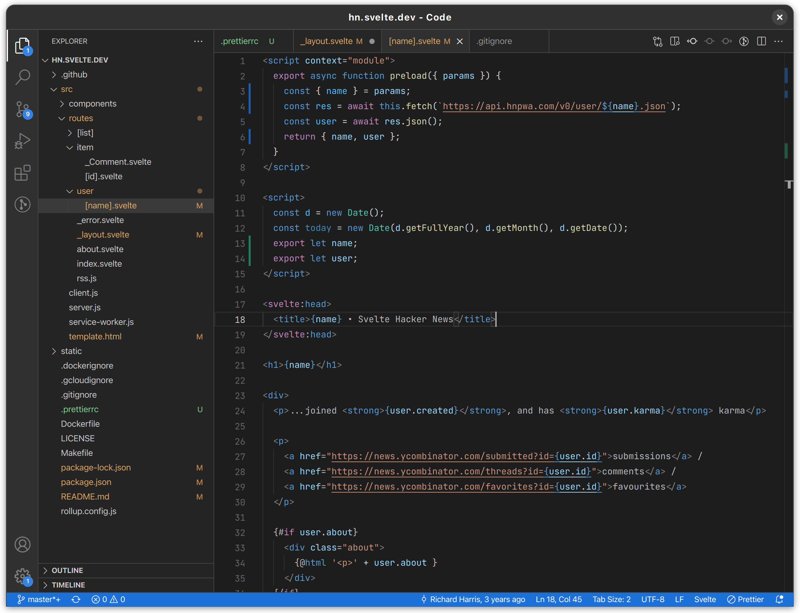

# Adwaita theme for VS Code

Dark and light themes based on GNOME's new Adwaita look and GNOME Builder's syntax highlighting.



Extra theme variants are included for those who prefer a colorful status bar and/or default syntax highlighting:

<br>
<small><center>Fonts shown: JetBrains Mono, SF Pro Text.</center></small>

## Installation

Get it on [VS Marketplace](https://marketplace.visualstudio.com/items?itemName=piousdeer.adwaita-theme) or [Open VSX](https://open-vsx.org/extension/piousdeer/adwaita-theme).

## Suggested settings

Open the Command Palette and find "Open Settings (JSON)". Here are the recommended settings:

```jsonc
"window.titleBarStyle": "custom",
"window.commandCenter": true,
"window.autoDetectColorScheme": true,
"workbench.preferredDarkColorTheme": "Adwaita Dark",
"workbench.preferredLightColorTheme": "Adwaita Light",
"workbench.productIconTheme": "adwaita",
"editor.renderLineHighlight": "none",
"workbench.iconTheme": null,
"workbench.tree.indent": 12,
```

[Rounded Window Corners](https://extensions.gnome.org/extension/5237/rounded-window-corners/) GNOME extension can be used to get rounded corners on all windows.

## Related projects

- [wroyca/vscode-gnome](https://github.com/wroyca/vscode-gnome) contains custom CSS that brings VS Code even closer to looking like a libadwaita app.

## Contributing

See [CONTRIBUTING.md](CONTRIBUTING.md).

<hr>

This project is not affiliated with GNOME Foundation.

[](https://pious.dev/donate)
